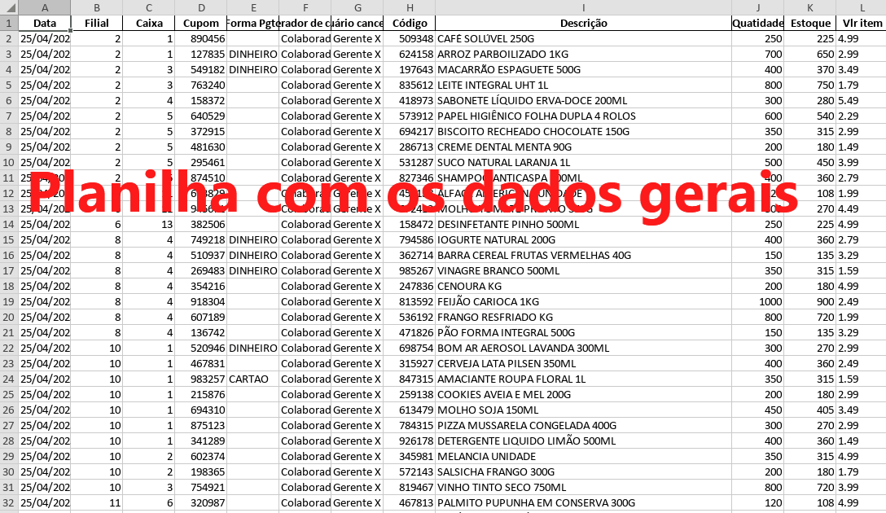

# Gerador Automático de Relatórios de Vendas


[](https://www.linkedin.com/in/oihenriquegomes/)

O **Gerador Automático de Relatórios de Vendas** é um projeto feito
para simplificar e automatizar a criação diária e entrega de relatórios de vendas canceladas para gerentes de várias
lojas. O principal objetivo é reduzir significativamente o tempo gasto nesse processo, aprimorando a eficiência e
minimizando o trabalho manual.

## Sumário

- [Contexto](#Contexto)
- [Recursos Principais](#Recursos-Principais)
- [Tecnologias Utilizadas](#Tecnologias-Utilizadas)
- [Configurações](#Configurações-antes-do-uso)
- [Uso](#Uso)
- [Licença](#Licença)

## Contexto

A inspiração para este projeto surgiu de desafios enfrentados no ambiente de trabalho.
Esta era uma tarefa demorada de criar manualmente relatórios para 37 lojas diferentes, gastando de 1 a 2 horas todos os
dias. Portanto, o projeto visa resolver esse problema automatizando todo o processo, reduzindo o tempo necessário para
meros 20 minutos.


## Recursos Principais

- **Criação Automática de Planilhas:** Gera relatórios de vendas canceladas em formato de planilha `.xlsx` já formatadas
  e com fórmulas configuradas.
- **Integração de E-mail:** Envia os relatórios gerados diretamente para os e-mails registrados em um arquivo de
  configuração `.json`.
- **Interface gráfica:** Possui uma interface gráfica para facilitar o uso de usuários leigos em programação.



## Tecnologias utilizadas

- : Neste projeto, o código em `JavaScript` foi utilizado
  para conferir dinamicidade à página e para integrar o `Node.js`, o `Electron.js` e os scripts python.
- : Já o `Python` foi utilizado para a criação de scripts de
  automação e manipulação de arquivos no sistema operacional Windows, como a criação de pastas por exemplo.
- : O `Electron.js` foi utilizado para a criação da interface do
  usuário.
- : O `Pandas` foi utilizado para obtenção, manipulação e registro de
  valores nas planilhas.
- : Por fim, o `Openpyxl` foi utilizado em geral para manipulação
  de estilos e formatação das planilhas.

## Configurações antes do uso

Primeiramente, rode o comando `npm install` (necessário Node.js) para instalar as dependências, em seguida crie um arquivo `.env` na pasta `root` do projeto com as informações de login da conta pela qual os
e-mails serão enviados dentro:

```env
EMAIL_USERNAME=email@hotmail.com
EMAIL_PASSWORD=senha123
```

Em seguida, acesse a pasta `app/config/` e renomeie o arquivo `put_email_list_here.JSON` para `lista_emails_lojas.JSON`,
dentro dele coloque os e-mails, neste projeto cada loja possui um código composto pela letra e número da loja, sendo
referenciada na chave e o e-mail no valor.

Por fim, ainda na pasta `config`, renomeie o arquivo `put_email_text_here.txt` para `email_body.txt`, abra-o e adicione
o texto que será enviado no corpo do e-mail. Esse texto pode ser feito com html e estilizado com css inline.

## Uso

1. Copie a tabela da planilha de teste, selecione a data do relatório e clique no botão para gerar a planilha geral;
2. Abra a planilha criada dentro da pasta `data` e faça os filtros dos dados que sairão no relatório final;
3. Clique no botão para gerar as planilhas por loja;
4. Abra o aplicativo do outlook e clique no botão para enviar planilhas.

## Contato

Você me chamar no: [LinkedIn](https://www.linkedin.com/in/oihenriquegomes/).

## Licença

Este projeto está licenciado sob a [Licença MIT](LICENSE), tornando-o aberto e acessível para colaboração e uso.

